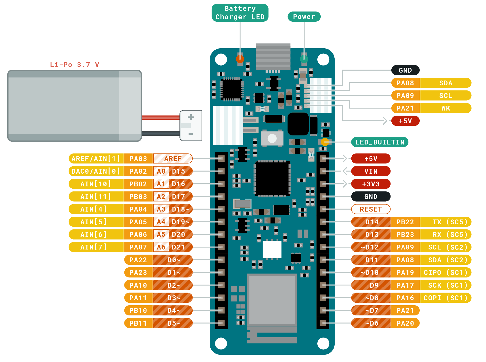

## Board Arduino MKR wifi 1010

The easiest entry point to basic IoT and pico-network application design.

Whether you are looking at building a sensor network connected to 
your office or home router, or if you want to create a Bluetooth® 
Low Energy device sending data to a cellphone, the MKR WiFi 1010 
is your one-stop-solution for many of the basic IoT application scenarios.

The MKR WiFi 1010 is a great choice for any beginner, maker or professional
to get started with Internet of Things (IoT). Using the popular Arm® 
Cortex®-M0 32-bit SAMD21 processor, it also features the and the ECC508 
crypto-chip for security. The board is part of the MKR family, where you 
can choose from a large variety of shields to build projects out of the 
box with minimal effort!

## Specifications

| Specification           | value                                      |
|:------------------------|:-------------------------------------------|
| Microcontroller         | SAMD21 Cortex®-M0+ 32bit low power ARM MCU |
 | Bluetooth®              | Nina W102 uBlox module                     |
| Wi-Fi                   | Nina W102 uBlox module                     |
| Secure element          | ATECC508A                                  |
| Operating Voltage       | 3.3V                                       |
 | Input Voltage (nominal) | 5-7V                                       |
| Supported Battery       | Li-Po Single Cell, 3.7V, 1024mAh Minimum   |
| Battery connector       | JST                                        |
| LED_BUILTIN             | 6                                          |
 | Digital I/O Pins        | 8                                          |
 | Analog Input Pins       | 7 (ADC 8/10/12 bit)                        |
| Analog Output Pins      | 1 (DAC 10 bit)                             |
| PWM Pins                | 13 (0 - 8, 10, 12, A3, A4)                 |
| External interrupts     | 10 (0, 1, 4, 5, 6, 7, 8 ,9, A1, A2)        |
 | DC Current per I/O Pin  | 7 mA                                       |
 | Flash Memory (SAMD)     | 256 KB                                     |
 | SRAM         (SAMD)     | 32 KB                                      |
 | Flash Memory (NINA)     | 2 MB                                       |
| SRAM         (NINA)     | 520 KB                                     |
| ROM          (NINA)     | 448 KB                                     |
 | Clock Speed             | 48 MHz                                     |
| RTC                     | 32.768 kHz                                 |
 | Length                  | 61.5 mm                                    |
 | Width                   | 25 mm                                      |
 | Weight                  | 32 g                                       |

[Schematics](datasheets/ArduinoMKRWifi-datasheet.pdf)

## Wiring

Pins operate in 3.3V.

