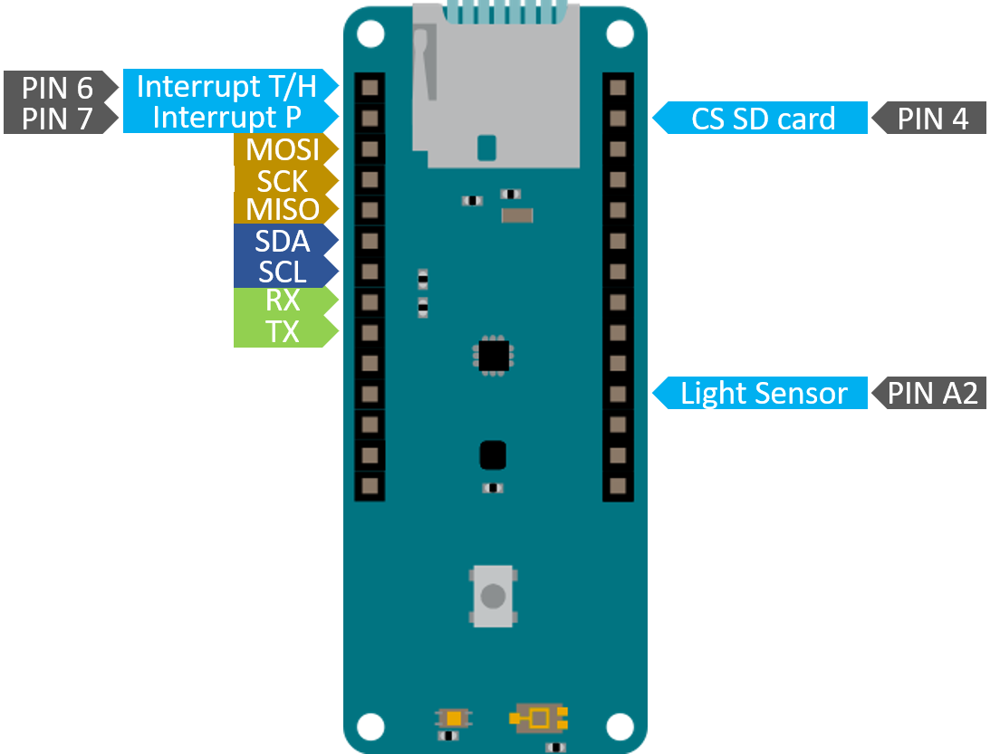

# Devices

## Commercial boards

### Adafruit 10 dof

### Adafruit MicroSD Breakout

### Adafruit Ultimate GPS v3

### BME280 

Combined humidity and pressure sensor.

[datasheet](datasheets/bme280.pdf)

### Chronodot v2.1

### nRF24L01+

### Seeeduino light sensor

## Commercial shield

### MKR Env (for Arduino MKR boards)

The MKR ENV Shield is a perfect addon for the MKR family series, 
and is capable of reading temperature, humidity, light and pressure. 
The data is acquired easily through an easy-to-use library, and has 
an SD card slot for offline data logging.

The MKR ENV Shield comes equipped with three sensors: 
[LPS22HB](datasheets/LPS22HB-datasheat.pdf), 
[HTS221](datasheets/HTS221-datasheet.pdf) and 
[TEMT6000](datasheets/TEMT6000-datasheet.pdf).
Some older version (like mine) have a [VEML6075](datasheets/VEML6075-datasheet.pdf).

It is perfect for data capturing projects, and is a low-threshold 
product for beginners to start working with real-time data. 
The shield's components are designed to operate in temperatures 
between -40 °C and +120 °C.

* SD card is a classic SD card reader on SPI protocol, With its CS value wired 
on PIN 4 of the MKR microcontroler.
* Light Sensor is a classical analog light sensor wired on pin A2.
* All other sensors use I2C communication protocol.

## Home-made devices

### LED Display

