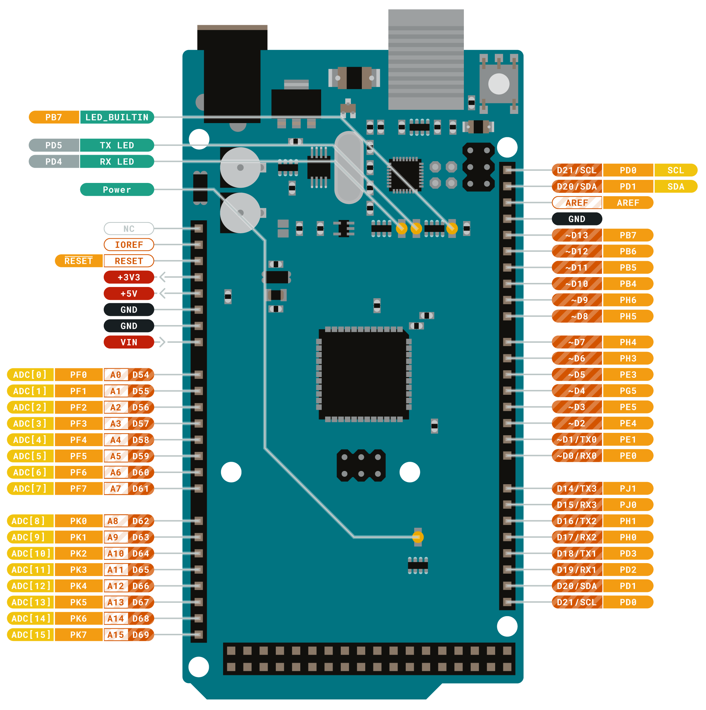
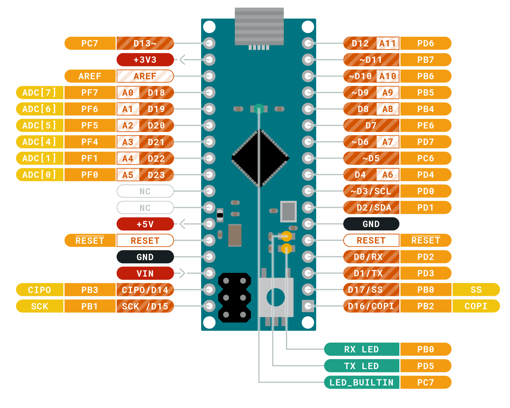
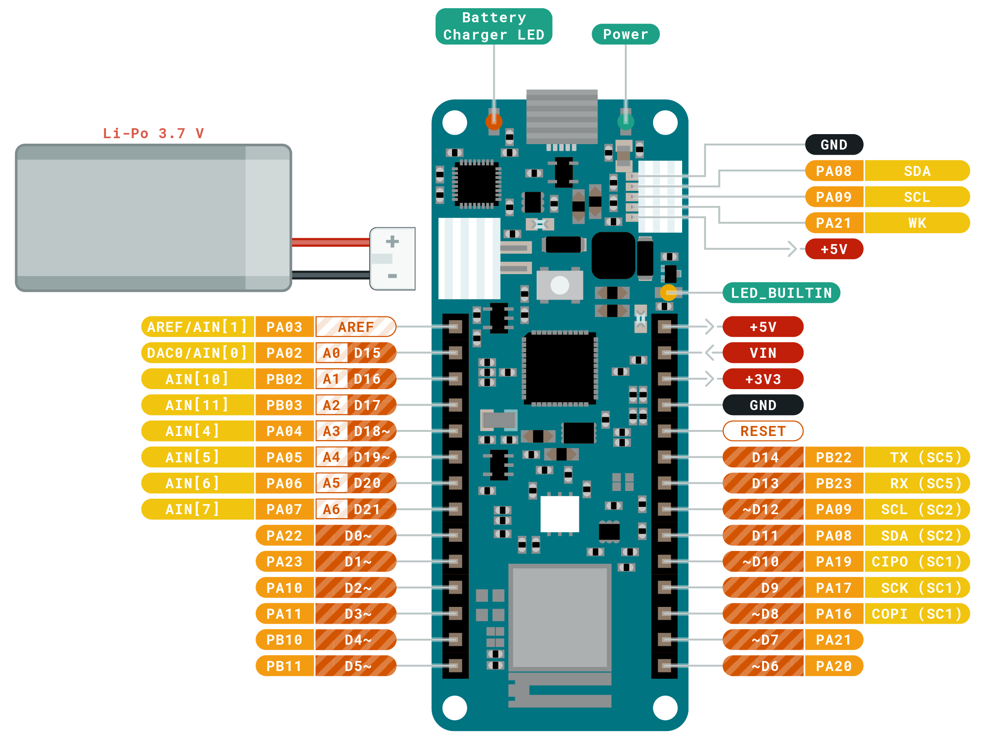
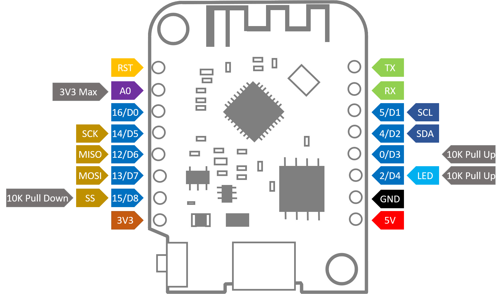

# Microcontrollers

This library is only compatible with the bords I have in stock.

## Summary and quick compare

Here is a very quick overview of the difference between our microcontrollers:

| spec        | Arduino micro | arduino MEGA   | Arduino MKR wifi | Wemos D1  |
|-------------|---------------|----------------|------------------|-----------|
| I/O Voltage | 5V            | 5V             | 3.3V             | 3.3V      |
| CPU clock   | 16 MHz        | 16 MHz         | 48 MHz           | 80/16 MHz |
| SRAM        | 2.5 KB        | 8 Kb           | 32 KB            | 50 KB     |
| Flash       | 32 KB         | 256 KB (-8 Kb) | 256 KB           | 4 MB      |
| EEPROM      | 1 KB          | 4 KB           |                  |           |
| Wifi        |               |                | Yes              | Yes       |

## Atmel AVR series

### Arduino MEGA 2560

The Arduino Mega 2560 is a microcontroller board based on the ATmega2560.
It has 54 digital input/output pins (of which 15 can be used as PWM outputs),
16 analog inputs, 4 UARTs (hardware serial ports),
a 16 MHz crystal oscillator, a USB connection, a power jack, an
ICSP header, and a reset button.
It contains everything needed to support the microcontroller;
simply connect it to a computer with a USB cable or power
it with a AC-to-DC adapter or battery to get started.
The Mega 2560 board is compatible with most shields designed for
the Uno and the former boards Duemilanove or Diecimila.

#### Specifications

| Specification               | value                                   |
|:----------------------------|:----------------------------------------|
| Microcontroller             | ATmega2560                              |
| Operating Voltage           | 5V                                      |
| Input Voltage (recommended) | 7-12V                                   |
| Input Voltage (limit)       | 6-20V                                   |
| Digital I/O Pins            | 54 (of which 15 provide PWM output)     |
| Analog Input Pins           | 16                                      |
| DC Current per I/O Pin      | 20 mA                                   |
| DC Current for 3.3V Pin     | 50 mA                                   |
| Flash Memory                | 256 KB of which 8 KB used by bootloader |
| SRAM                        | 8 KB                                    |
| EEPROM                      | 4 KB                                    |
| Clock Speed                 | 16 MHz                                  |
| LED_BUILTIN                 | 13                                      |
| Length                      | 101.52 mm                               |
| Width                       | 53.3 mm                                 |
| Weight                      | 37 g                                    |

[Schematics](datasheets/MEGA2560_Rev3e.pdf)

#### Wiring

Pins operate in 5V.

### Arduino micro

The Micro is a microcontroller board based on the ATmega32U4, developed in conjunction with Adafruit.
It has 20 digital input/output pins (of which 7 can be used as PWM outputs and 12 as analog inputs),
a 16 MHz crystal oscillator, a micro USB connection, an ICSP header, and a reset button.
It contains everything needed to support the microcontroller; simply connect it to a computer
with a micro USB cable to get started. It has a form factor that enables it to be easily
placed on a breadboard. The Micro board is similar to the Arduino Leonardo in that the
ATmega32U4 has built-in USB communication, eliminating the need for a secondary processor.
This allows the Micro to appear to a connected computer as a mouse and keyboard,
in addition to a virtual (CDC) serial / COM port.

#### Specifications

| Specification               | value      |
|:----------------------------|:-----------|
| Microcontroller             | ATmega32u4 |
| Operating Voltage           | 5V         |
| Input Voltage (recommended) | 7-12V      |
| Digital I/O Pins            | 20         |
| Analog Input Pins           | 12         |
| PWM Pins                    | 7          |
| DC Current per I/O Pin      | 20 mA      |
| Flash Memory                | 32 KB      |
| SRAM                        | 2.5 KB     |
| EEPROM                      | 1 KB       |
| Clock Speed                 | 16 MHz     |
| LED_BUILTIN                 | 13         |
| Length                      | 48 mm      |
| Width                       | 18 mm      |
| Weight                      | 13 g       |

#### Wiring

Pins operate in 5V.

## Atmel SAM series

### Arduino MKR Wifi

The easiest entry point to basic IoT and pico-network application design.

Whether you are looking at building a sensor network connected to
your office or home router, or if you want to create a Bluetooth®
Low Energy device sending data to a cellphone, the MKR WiFi 1010
is your one-stop-solution for many of the basic IoT application scenarios.

The MKR WiFi 1010 is a great choice for any beginner, maker or professional
to get started with Internet of Things (IoT). Using the popular Arm®
Cortex®-M0 32-bit SAMD21 processor, it also features the and the ECC508
crypto-chip for security. The board is part of the MKR family, where you
can choose from a large variety of shields to build projects out of the
box with minimal effort!

#### Specifications

| Specification           | value                                      |
|:------------------------|:-------------------------------------------|
| Microcontroller         | SAMD21 Cortex®-M0+ 32bit low power ARM MCU |
| Bluetooth®              | Nina W102 uBlox module                     |
| Wi-Fi                   | Nina W102 uBlox module                     |
| Secure element          | ATECC508A                                  |
| Operating Voltage       | 3.3V                                       |
| Input Voltage (nominal) | 5-7V                                       |
| Supported Battery       | Li-Po Single Cell, 3.7V, 1024mAh Minimum   |
| Battery connector       | JST                                        |
| LED_BUILTIN             | 6                                          |
| Digital I/O Pins        | 8                                          |
| Analog Input Pins       | 7 (ADC 8/10/12 bit)                        |
| Analog Output Pins      | 1 (DAC 10 bit)                             |
| PWM Pins                | 13 (0 - 8, 10, 12, A3, A4)                 |
| External interrupts     | 10 (0, 1, 4, 5, 6, 7, 8 ,9, A1, A2)        |
| DC Current per I/O Pin  | 7 mA                                       |
| Flash Memory (SAMD)     | 256 KB                                     |
| SRAM         (SAMD)     | 32 KB                                      |
| Flash Memory (NINA)     | 2 MB                                       |
| SRAM         (NINA)     | 520 KB                                     |
| ROM          (NINA)     | 448 KB                                     |
| Clock Speed             | 48 MHz                                     |
| RTC                     | 32.768 kHz                                 |
| Length                  | 61.5 mm                                    |
| Width                   | 25 mm                                      |
| Weight                  | 32 g                                       |

[Schematics](datasheets/ArduinoMKRWifi-datasheet.pdf)

#### Wiring

Pins operate in 3.3V.

## Espressif ESP8266 Series

### Wemos D1 Mini

A mini wifi board with 4MB flash based on ESP-8266EX ([datasheet](datasheets/esp8266ex_datasheet_en.pdf)).
In stck we have the v3.0.0.

#### Specifications

* 11 digital IO, interrupt/pwm/I2C/one-wire supported(except D0)
* Micro USB connexion.
* 1 analog input(3.2V max input)

| Specification     | value       |
|:------------------|:------------|
| Operating Voltage | 3.3V        |
| Digital I/O       | 11          |
| Analog Input Pins | 1(3.2V Max) |
| Clock Speed       | 80/160MHz   |
| Flash             | 4M Bytes    |
| Size              | 34.2*25.6mm |
| Weight            | 3g          |

[Schematics](datasheets/d1_mini_v3.0.0.pdf)

#### Wiring

All pins runs at 3.3V

| Pin  | Function                     | ESP-8266 Pin |
|:-----|:-----------------------------|:-------------|
| TX   | TXD                          | TXD          |
| RX   | RXD                          | RXD          |
| A0   | Analog input, max 3.2V       | A0           |
| D0   | IO                           | GPIO16       |
| D1   | IO, SCL                      | GPIO5        |
| D2   | IO, SDA                      | GPIO4        |
| D3   | IO, 10k Pull-up              | GPIO0        |
| D4   | IO, 10k Pull-up, BUILTIN_LED | GPIO2        |
| D5   | IO, SCK                      | GPIO14       |
| D6   | IO, MISO                     | GPIO12       |
| D7   | IO, MOSI                     | GPIO13       |
| D8   | IO, 10k Pull-down, SS        | GPIO15       |
| G    | Ground                       | GND          |
| 5V   | 5V                           | -            |
| 3V3  | 3.3V                         | 3.3V         |
| RST  | Reset                        | RST          |

